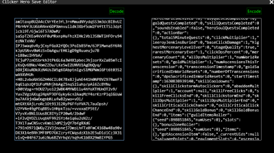
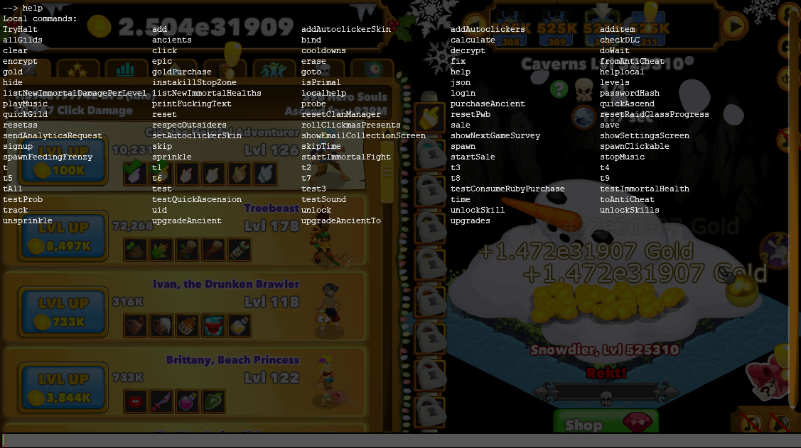

# Clicker Hero Save Editor
Just a simple program created in C# WPF to gain the JSON data of the save file from the 'Clicker Hero' game

## How to use
  1. Gain the base64 encoding from the 'Clicker Hero' game 
  2. Paste it within the textbox within the left hand side and click 'Decode'
  3. On the right hand side the JSON data would output, you can edit it
  4. After editing it, press encode on top if and it will encode the JSON data to base64
  5. Paste that within the game save options and it will change the save data

## Preview

## Result
Result here shows the debug menu being displayed

